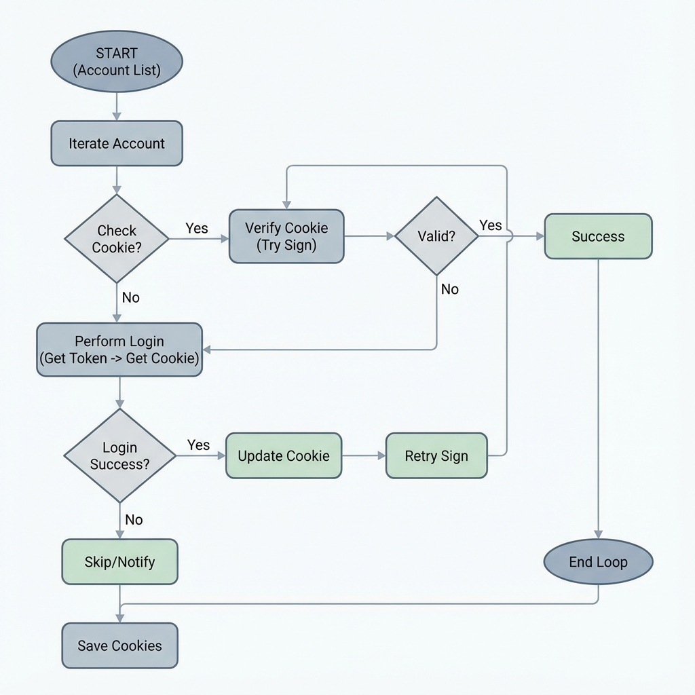

# NodeSeek Login & Verification Analysis Report

## 1. System Overview
The codebase implements an automated sign-in bot for NodeSeek using Python. It handles:
- Environment detection (Docker, QingLong, GitHub Actions)
- Cloudflare Turnstile verification bypass
- Session persistence (Cookies)
- Notification logic

## 2. Verification & Bypass Mechanism

### A. TLS/JA3 Fingerprinting
**Mechanism**: Cloudflare analyzes the TLS handshake (Client Hello) to identify the client implementation (e.g., Python `requests` vs real Chrome).
**Implementation**: 
- Uses `curl_cffi` library.
- **Key Setting**: `impersonate="chrome136"` (Found in `nodeseek_sign.py`).
- **Effect**: Successfully mimics a standard Chrome browser's TLS signature, preventing immediate blocking by Cloudflare's bot protection layer at the network level.

### B. Interactive Challenge (Turnstile)
**Mechanism**: Cloudflare Turnstile requires a cryptographic challenge to be solved (JavaScript execution) to generate a temporary token.
**Implementation**:
- **Strategy**: Logic outsourcing (API-based solving).
- **Files**: `turnstile_solver.py` and `yescaptcha.py`.
- **Process**:
    1. Extract `sitekey` (`0x4AAAAAAAaNy7leGjewpVyR`) from `nodeseek_sign.py`.
    2. Send `sitekey` + `url` to an external solver API (`API_BASE_URL` or YesCaptcha).
    3. External service solves the JS challenge.
    4. Returns a `token`.
    5. Bot submits `token` to `https://www.nodeseek.com/api/account/signIn` along with credentials.

## 3. Code Quality Review

### Critical Issues
- **Cyclomatic Complexity**: The `main` execution block (`if __name__ == "__main__":`) contains excessive nesting (5+ layers).
- **Redundant Logic**: Login retry logic is interwoven with the initial sign-in attempt, making it hard to follow.
- **Global State**: Reliance on global variables (`hadsend`) for optional features.

### Suggested Refactoring
The current main loop should be refactored into a linear state machine or separated functions:
1. `load_accounts()`
2. `check_cookie_validity(account)`
3. `perform_login(account)`
4. `do_signin_task(browser_session)`

## 4. Visual Flow

